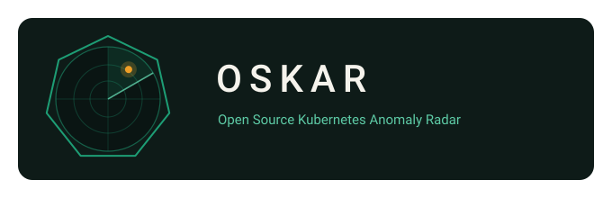

<p align="center">
  
</p>

# OSKAR — Open Source Kubernetes Anomaly Radar

> Finds the invisible broken links in your cluster **before** they page you at 3 a.m.

OSKAR performs a **read-only** scan of your cluster and reports **silent state
inconsistencies**: the broken references between objects that raise no events,
trip no probes and keep every dashboard green — while quietly blackholing
traffic or blocking the whole API server.

Most tools check *best-practice violations* (Polaris, Popeye) or *unused
resources* (kor). OSKAR checks something different: **whether the links
between your objects are actually intact right now.**

## Why?

A true story, and you probably have your own version of it: a production
service starts showing absurd TTFB spikes. Pods healthy, probes green,
HPA quiet, nodes fine. Hours of triage later, the cause turns out to be an
**orphaned EndpointSlice with a ghost IP** — the endpoint controller had lost
sync and a share of the traffic was being routed to an address nobody owned.
Nothing in `kubectl get` showed it. No event was ever emitted.

That whole class of failures — ghost endpoints, admission webhooks pointing
at dead services, ingresses referencing nothing — is exactly what OSKAR is
built to catch in seconds instead of hours.

## What it checks

| Check | Severity | What it catches |
|---|---|---|
| `ghost-endpoints` | CRITICAL | *Ready* EndpointSlice entries pointing at dead pods or mismatched IPs (silent traffic blackholes) |
| `dead-webhook` | CRITICAL/WARNING | Validating/Mutating webhooks whose backend Service is missing or has no ready endpoints (the classic invisible cluster-wide outage) |
| `broken-ingress` | CRITICAL | Ingress backends referencing missing Services or ports (requests 502/503) |
| `service-selector` | WARNING | Services whose selector matches zero pods (traffic goes nowhere) |
| `cert-expiry` | CRITICAL/WARNING | TLS Secrets expired or expiring within `--cert-warn-days` |
| `stuck-terminating` | WARNING | Pods/Namespaces/PVCs stuck in Terminating beyond `--stuck-threshold` (finalizers, dead APIServices) |
| `released-pv` | WARNING/CRITICAL | PVs in Released/Failed phase (data allocated, unusable) |
| `orphaned-hpa` | WARNING | HPAs whose scale target (Deployment/StatefulSet/ReplicaSet) no longer exists |
| `openshift-route` | CRITICAL | Routes referencing missing Services — auto-skipped on non-OpenShift clusters |

Run `oskar checks` for the live list, including the resources each check
lists (that is also your RBAC checklist).

## Install

**From source** (Go 1.26+):

```bash
git clone https://github.com/alessandrocorsico/oskar.git
cd oskar
make build            # -> bin/oskar
```

**As a kubectl plugin** (a kubectl plugin is just a binary named
`kubectl-oskar` on your PATH):

```bash
make install-plugin   # -> kubectl oskar scan
```

**From GitHub Releases**: download the archive for your OS/arch, verify it,
extract, drop `oskar` somewhere on your PATH. Releases ship a `checksums.txt`
signed with [cosign](https://docs.sigstore.dev/) (keyless, GitHub OIDC; the
signature, certificate and transparency-log entry travel together in the
`checksums.txt.sigstore.json` bundle) and an SBOM per archive:

```bash
cosign verify-blob checksums.txt \
  --bundle checksums.txt.sigstore.json \
  --certificate-identity-regexp 'https://github.com/alessandrocorsico/oskar/.*' \
  --certificate-oidc-issuer https://token.actions.githubusercontent.com
sha256sum -c --ignore-missing checksums.txt
```

**Container image**: `ghcr.io/alessandrocorsico/oskar:<version>` (linux/amd64
and linux/arm64, distroless, non-root, signed). Image tags carry the version
without the `v` prefix, so release `v0.2.1` is image tag `0.2.1`:

```bash
cosign verify ghcr.io/alessandrocorsico/oskar:0.2.1 \
  --certificate-identity-regexp 'https://github.com/alessandrocorsico/oskar/.*' \
  --certificate-oidc-issuer https://token.actions.githubusercontent.com
```

**Via krew** (once the plugin is accepted into the krew-index):

```bash
kubectl krew install oskar
```

### Testing the krew manifest locally (before submitting)

Two levels of validation, cheapest first.

**Render the manifest with no release at all** (Docker, offline). This runs
the same templating the bot uses and prints the final YAML, so you catch
template/indentation errors before you ever tag:

```bash
docker run -v "$PWD/.krew.yaml:/tmp/.krew.yaml" \
  ghcr.io/rajatjindal/krew-release-bot:v0.0.51 \
  krew-release-bot template --tag v0.2.1 --template-file /tmp/.krew.yaml
```

**Install from a real archive** (after your first release exists):

```bash
# offline, against a locally built archive (checks manifest structure):
kubectl krew install --manifest=.krew.yaml \
  --archive=dist/oskar_linux_amd64.tar.gz   # add -v=4 if it fails

# online, against the published release (validates the real URI + sha256):
kubectl krew install --manifest=.krew.yaml
kubectl oskar scan
kubectl krew uninstall oskar
```

### Publishing to the krew-index

The **first submission** of a plugin to the krew-index must be a pull
request opened by a human author: fork `kubernetes-sigs/krew-index`, add
`plugins/oskar.yaml` (the rendered manifest, with the real SHA256s of a
published release), and explain how the plugin differs from existing ones.
The krew-index review rules also forbid usage examples inside
`description` and `caveats`: describe what the checks do, not how to run
them. A maintainer reviews it by hand; do not tag maintainers.

Once the plugin is listed, `.github/workflows/release.yaml` takes over with
the **krew-release-bot** (`rajatjindal/krew-release-bot`): after GoReleaser
publishes the GitHub Release, the bot renders `.krew.yaml` with real SHA256s
and opens the version-bump PR, which is auto-merged. It needs **no extra
secrets**: the bot runs as a hosted service and opens the PR from its own
fork. It is the only publisher configured on purpose (two publishers mean
duplicate PRs).

If the bot step fails after the release was published, re-run just the bot
with the manual `Krew index` workflow. It must run **on the tag**, because
the bot finds the release through the commit it runs on:

```bash
gh workflow run krew.yaml --ref v0.2.1 -f tag=v0.2.1
```

> **Ownership, do not skip.** The bot uses the `homepage:` field in
> `.krew.yaml` to prove you own the plugin: it must equal the GitHub repo
> you publish releases from, currently
> `https://github.com/alessandrocorsico/oskar`. If the repository ever
> moves, update `homepage` in the same release, or the update PRs will be
> rejected.

## Quick start

```bash
# Scan the current kubeconfig context, all namespaces
oskar scan

# One namespace, JSON output (for CI or piping into jq)
oskar scan -n production -o json

# Use in CI as a gate: exit 2 only on CRITICAL findings
oskar scan --fail-on critical

# Skip the secret-reading check if your RBAC forbids secrets
oskar scan --skip-checks cert-expiry

# Pre/post cluster-upgrade sanity pass on a specific context; --strict also
# fails the scan (exit 1) when any resource could not be listed
oskar scan --context prod-eks --fail-on warning --strict

# Hide a namespace full of known-noisy objects
oskar scan --exclude-namespaces sandbox,kube-system
```

Example output:

```
[CRITICAL] ghost-endpoints  default/EndpointSlice/web-7f4k2 (Service/web)
    ready endpoint 10.0.14.7 targets pod "web-6d4f9c-x2plq" which no longer exists — stale entry blackholing a share of the Service traffic
    hint: the endpoint controller lost sync; check kube-controller-manager health, then force a resync (e.g. re-apply the Service) or delete the stale EndpointSlice

[CRITICAL] dead-webhook  ValidatingWebhookConfiguration/policy-webhook (Service/policy/policy-svc)
    webhook "validate.policy.example.com" points at Service policy/policy-svc which does not exist (failurePolicy=Fail)
    hint: with failurePolicy=Fail the API server rejects every matching request until this is fixed — the classic invisible cluster-wide outage; fix the reference or remove the webhook configuration

Summary: 2 critical, 0 warning, 0 info — 2 findings from 9 checks in 1.8s
```

## Exit codes

| Code | Meaning |
|---|---|
| 0 | Clean (no findings at or above `--fail-on`) |
| 1 | Runtime error: bad flags, unreachable API server, bad credentials, timeout, or (with `--strict`) a resource that could not be listed |
| 2 | Findings at or above the `--fail-on` severity |

A scan that could not read its data never exits 0 pretending the cluster is
clean: see [When permissions are missing](#when-permissions-are-missing).
This makes OSKAR safe to wire into GitLab CI, Tekton, GitHub Actions or
Argo Workflows as a pre/post-deploy or pre/post-upgrade gate.

## Flags

| Flag | Default | Description |
|---|---|---|
| `--kubeconfig` | kubectl default chain | Explicit kubeconfig path |
| `--context` | current context | Kubeconfig context |
| `-n, --namespace` | all | Restrict namespaced checks to one namespace; cluster-scoped checks (webhooks, PVs, namespaces) always look at the whole cluster |
| `-o, --output` | `table` | `table` or `json` |
| `--checks` | all | Run only these checks |
| `--skip-checks` | none | Skip these checks |
| `--exclude-namespaces` | none | Drop findings from these namespaces |
| `--cert-warn-days` | `30` | TLS expiry warning window |
| `--stuck-threshold` | `1h` | Terminating age before flagging |
| `--request-timeout` | `2m` | Timeout for each API request (`0` = none) |
| `--strict` | false | Exit 1 when any resource cannot be listed instead of skipping the checks that need it |
| `--fail-on` | `warning` | `critical`, `warning`, `info` or `never` |
| `--no-color` | false | Disable ANSI colors (also honors `NO_COLOR`) |

`SIGINT`/`SIGTERM` cancel in-flight API calls, so a Job deadline or a Ctrl-C
never leaves a half-finished scan hanging.

## When permissions are missing

Every check declares the resources it reads (`oskar checks` shows them).
OSKAR lists only what the selected checks need, and classifies what goes
wrong:

- **403 Forbidden** (RBAC) or **404** (API group not served): the resource is
  marked unavailable, a notice is printed, and **every check that needs it
  is skipped**. A check is never run on empty data — no `list pods` means
  "ghost-endpoints skipped", not "every endpoint is a ghost".
- **Anything else** (unreachable API server, bad credentials, timeout): the
  scan aborts with exit 1. A report produced without data would be a false
  "all clear".
- `--strict` turns the first case into the second, for gates that must not
  pass on a degraded scan.

With `--namespace`, checks that follow references from cluster-scoped
objects (webhooks → Services) list Services and EndpointSlices cluster-wide
anyway, because a webhook in namespace A legitimately points at a Service in
namespace B. If your RBAC only allows the namespace, OSKAR falls back to it
and reports `dead-webhook` as skipped rather than inventing an outage.

## Silencing findings

A radar with no mute button gets turned off, so:

- Annotate an object with `oskar.io/ignore: "true"` to silence every check
  on it, or with a comma-separated list of check names
  (`oskar.io/ignore: "service-selector"`) to silence only those. Typical
  use: Services of KEDA/Knative workloads that scale to zero on purpose.
  For `ghost-endpoints` the annotation is honored on the Service.
- `--exclude-namespaces` drops findings from whole namespaces.
- Every finding carries a stable `fingerprint` (check + object + related
  objects, not the message) so external tooling can diff two reports or keep
  its own allowlist.

## Compatibility

OSKAR speaks only **standard Kubernetes APIs** through your kubeconfig, and
authentication is delegated to client-go's exec/OIDC plugin support — so it
works wherever `kubectl` works:

| Distribution | Works | Notes |
|---|---|---|
| Amazon EKS | ✅ | via `aws eks get-token` exec plugin |
| Azure AKS | ✅ | via `kubelogin` / azure exec plugin |
| Google GKE | ✅ | via `gke-gcloud-auth-plugin` |
| OpenShift / OKD | ✅ | plus the extra `openshift-route` check (auto-detected) |
| Rancher RKE2 / K3s | ✅ | |
| kind / minikube / vanilla | ✅ | |

The OpenShift Route check is gated on API discovery: if the
`route.openshift.io/v1` group isn't served, it silently skips. No
distribution-specific client libraries are used. Typed resources are
fetched as protobuf and workloads as metadata only, to keep large clusters
cheap for the API server.

## RBAC — read-only by design

OSKAR never writes anything. It needs `list` on the resources it inspects
(no `get`, no `watch`); `deploy/rbac.yaml` ships a least-privilege
ClusterRole.

**About secrets, honestly.** The `cert-expiry` check lists TLS secrets with
a server-side field selector (`type=kubernetes.io/tls`) and drops `tls.key`
the moment the response is decoded, so OSKAR itself never looks at opaque
secrets, tokens or private keys. But a field selector is **not** an
authorization boundary: granting `list secrets` cluster-wide means whoever
holds the oskar ServiceAccount token can read every Secret in the cluster.
If that is not acceptable in your threat model, remove that rule from the
ClusterRole and run with `--skip-checks cert-expiry`: the check is reported
as skipped, everything else keeps working.

## Run it in-cluster (scheduled scans)

```bash
kubectl apply -k deploy/          # namespace (PSA restricted), SA, ClusterRole, CronJob
```

`deploy/cronjob.yaml` runs the signed image as a non-root, read-only,
seccomp-confined Pod and is safe by construction against the classic
CronJob trap: with `concurrencyPolicy: Forbid`, one scan hanging on an
unresponsive API server would silently block every future run, so the Job
has an `activeDeadlineSeconds`, the CronJob a `startingDeadlineSeconds`,
and oskar itself a `--request-timeout`. With `--fail-on critical` the Job
fails when criticals exist, so your existing Job alerting
(kube-state-metrics `kube_job_failed` on the `app.kubernetes.io/name=oskar`
labels + Alertmanager) becomes the notification channel for free.

## Use it in GitLab CI

Ready-made job templates live in
[`examples/gitlab/oskar-scan.gitlab-ci.yml`](examples/gitlab/oskar-scan.gitlab-ci.yml):
a base job (download + checksum verification) plus variants for a kubeconfig
**File variable**, the **GitLab Kubernetes Agent**, **EKS**
(`aws eks update-kubeconfig`) and **OpenShift** (ServiceAccount token with
the API CA), and a scheduled "radar" job for
`CI_PIPELINE_SOURCE == "schedule"`. Exit codes do the gating; the JSON
report is saved as a job artifact. The repo also ships a root
`.gitlab-ci.yml`, so mirroring it on a private GitLab builds, tests and
releases out of the box.

## JSON output

`-o json` is the product; the table is just its first renderer. The shape is
versioned (`schemaVersion`) and self-describing:

```json
{
  "schemaVersion": "1",
  "generatedAt": "2026-09-05T07:00:12Z",
  "scan": {
    "oskarVersion": "v0.2.1",
    "context": "prod-eks",
    "server": "https://ABC.gr7.eu-south-1.eks.amazonaws.com",
    "checks": [
      { "name": "ghost-endpoints", "state": "ok", "findings": 1 },
      { "name": "cert-expiry", "state": "skipped", "reason": "secrets could not be listed" }
    ]
  },
  "summary": { "critical": 1, "warning": 0, "info": 0, "total": 1,
               "checksRun": 8, "checksSkipped": 1, "checksFailed": 0, "durationMs": 1830 },
  "findings": [
    {
      "check": "ghost-endpoints",
      "severity": "CRITICAL",
      "namespace": "default",
      "kind": "EndpointSlice",
      "name": "web-7f4k2",
      "related": [ { "kind": "Service", "namespace": "default", "name": "web" } ],
      "message": "ready endpoint 10.0.14.7 targets pod \"web-6d4f9c-x2plq\" which no longer exists — ...",
      "hint": "the endpoint controller lost sync; ...",
      "fingerprint": "9f1c2a7b3d4e5f60"
    }
  ],
  "notices": [ "could not list secrets (forbidden by RBAC); checks that need them were skipped" ]
}
```

## Architecture

```
cmd/oskar            → CLI entry point (signals, exit codes)
internal/cli         → cobra commands (scan, checks, version)
internal/cluster     → client config + Snapshot (declared needs, one-shot fetch, indexed lookups)
internal/checks      → the Check interface, the engine (RunAll) + one file per check
internal/report      → renderers: human table, JSON
```

Three design decisions carry the project:

1. **Snapshot first, checks after.** Each check declares the resources it
   needs; the snapshot lists exactly those (typed resources as protobuf,
   workloads as metadata only), concurrently, with Pods last so that an
   EndpointSlice is never newer than the pods it points at. Checks are pure
   functions over that snapshot — no API calls inside checks — which makes
   them fast, deterministic and unit-testable with plain structs.
2. **Missing data is not "nothing there".** The snapshot remembers what it
   could not list; the engine skips the checks that depend on it and says
   so. Network and auth failures abort the scan instead.
3. **The JSON output is the product.** The CLI table is just the first
   renderer of `report.Output`. A web dashboard, a Lens extension or a
   Prometheus exporter can consume the same structure without touching the
   engine.

### Writing a new check

A check is one file implementing four methods:

```go
type MyCheck struct{}

func (c *MyCheck) Name() string        { return "my-check" }
func (c *MyCheck) Description() string { return "What it catches" }
func (c *MyCheck) Needs() []cluster.Need {
    return cluster.Needs(cluster.ResourceServices, cluster.ResourcePods)
}

func (c *MyCheck) Run(_ context.Context, snap *cluster.Snapshot, opts checks.Options) ([]checks.Finding, error) {
    var out []checks.Finding
    // inspect snap.<Resources>, append Findings with Kind/Name/Related + Message + Hint
    return out, nil
}
```

Register it in `checks.All()`, add a test, done. See
[CONTRIBUTING.md](CONTRIBUTING.md).

## Roadmap

- [ ] Submit to the [krew-index](https://krew.sigs.k8s.io/) after the first tagged release
      (manifest ready in `.krew.yaml`, all 6 platforms, LICENSE extracted;
      the release workflow opens the PR)
- [ ] More checks: PDBs that would block node drains, APIServices
      Available=False, orphaned finalizer patterns on CRDs, Service
      `targetPort` vs container port mismatch
- [ ] `--confirm`: re-scan after a short delay and keep only findings present
      in both passes (kills the remaining rollout races)
- [ ] `--output html` self-contained report
- [ ] `oskar serve`: tiny web dashboard rendering the JSON output
- [ ] Prometheus metrics mode for continuous in-cluster radar
- [ ] List pagination for very large clusters

## Brand assets

`assets/` ships the project identity as vectors:
`oskar-mark.svg` (primary mark), `oskar-banner.svg` (horizontal lockup,
used above), `oskar-mark-mono.svg` (single-colour, inherits `currentColor`,
drop it in any dark or light context) and `favicon.svg` (simplified,
legible down to 16 px). Palette: radar ground `#0E1B18`, rings `#1D9E75`,
anomaly blip `#EF9F27`.

The mark is a radar screen framed by a seven-sided polygon, a nod to
Kubernetes rather than a reuse of its logo. OSKAR is an independent
project and is not endorsed by or affiliated with the CNCF or the
Kubernetes project.

## License

[Apache-2.0](LICENSE)
